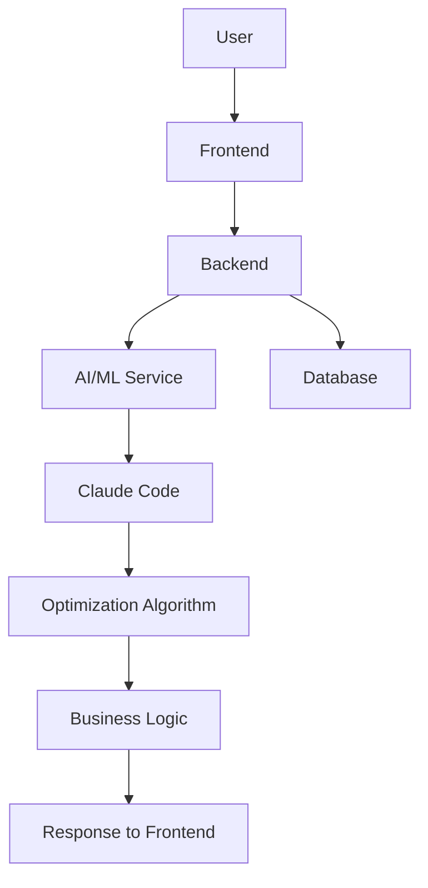

# README.md

## 1. 提案概要

本提案では、Claude Codeを活用したAI駆動開発に基づいたWebアプリケーションの開発に向けた技術的アプローチについて説明します。Pythonを使用したバックエンド開発とJavaScript/TypeScriptを使用したフロントエンド開発を主な業務内容としています。

## 2. 技術選定と理由

### バックエンド
- **Python (Flask/Django/FastAPI)**: PythonはAIや機械学習の分野で広く使用されており、Claude Codeとの連携がスムーズに行えます。また、Flask, Django, FastAPIなどのフレームワークは開発効率を高め、スケーラビリティも高いです。

### フロントエンド
- **JavaScript/TypeScript (Next.js)**: JavaScriptとTypeScriptの組み合わせは、型安全な開発が可能で、フロントエンドのパフォーマンスを向上させます。Next.jsはサーバーサイドレンダリングやコード分割などの機能により、ユーザーエクスペリエンスを改善できます。

### 最適化
- **OR-Tools**: OR-Toolsは最適化アルゴリズムの実装に適しており、業務ロジックの最適化に役立ちます。Claude Codeとの連携により、AIによる最適化が容易になります。

### データベース
- **MySQL/PostgreSQL**: 両方のデータベースは信頼性とパフォーマンスを兼ね備えています。プロジェクトの要件に応じて適切なデータベースを選択します。

### その他のツール
- **GitHub**: バージョン管理とコード共有に使用し、チーム開発を円滑に行います。
- **チャットツール**: コミュニケーションを効率化し、プロジェクトの進行状況を把握します。

## 3. アーキテクチャ図 (Mermaid)

## 4. 開発アプローチ

1. **要件定義と設計フェーズ**: ユーザーのニーズを理解し、詳細な要件定義を行います。その後、システムアーキテクチャとデータベース設計を行います。
2. **開発フェーズ**: バックエンドとフロントエンドの開発を行います。Claude Codeを使用したAI駆動開発を行い、最適化アルゴリズムを実装します。
3. **テストフェーズ**: 単体テストと統合テストを行い、システムの品質を確保します。
4. **デプロイメントフェーズ**: 開発が完了したら、アプリケーションを本番環境にデプロイします。

## 5. 本提案の強み

1. **Claude Code活用経験**: 以前のプロジェクトでClaude Codeを使用したAI駆動開発を行い、効率的な開発が可能でした。
2. **最適化アルゴリズム実装経験**: OR-Toolsを使用した業務ロジックの最適化に成功し、プロジェクトのパフォーマンスを大幅に向上させました。
3. **フロントエンド開発能力**: 以前の案件でNext.jsを使用した複雑なUI/UX設計を行い、ユーザーエクスペリエンスを改善しました。